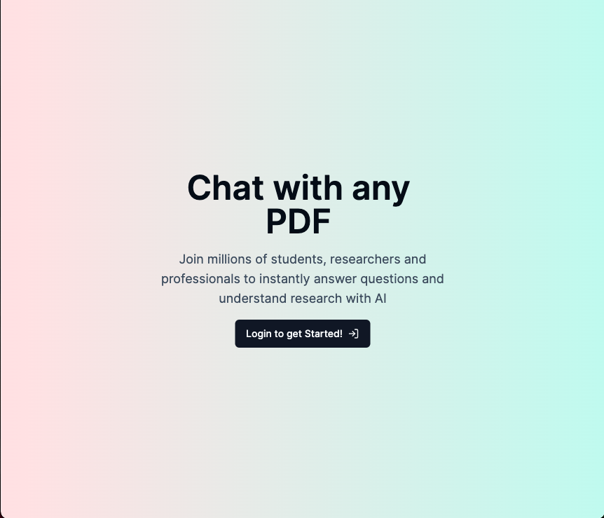
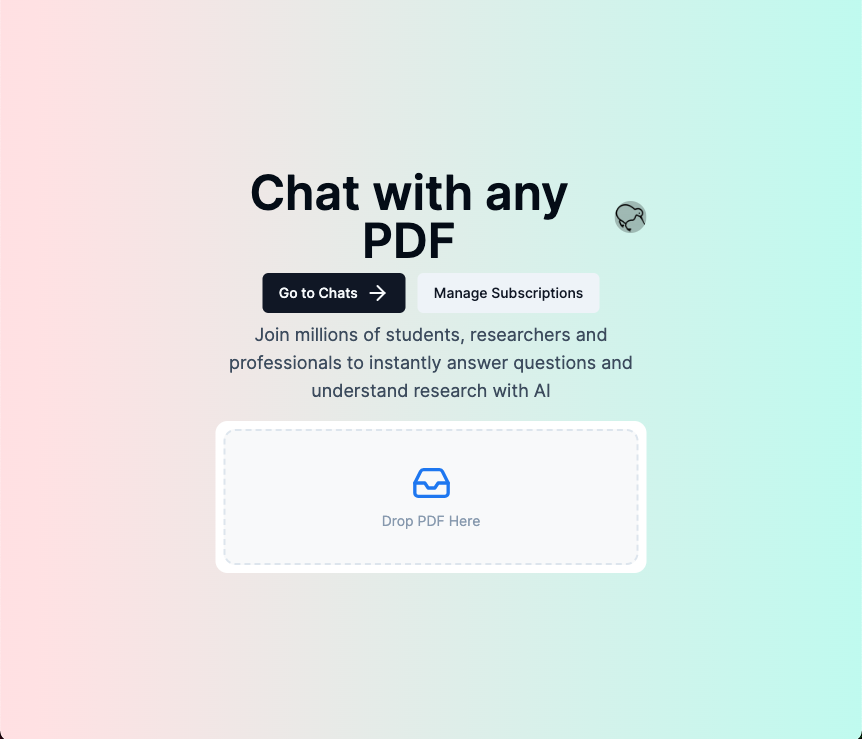
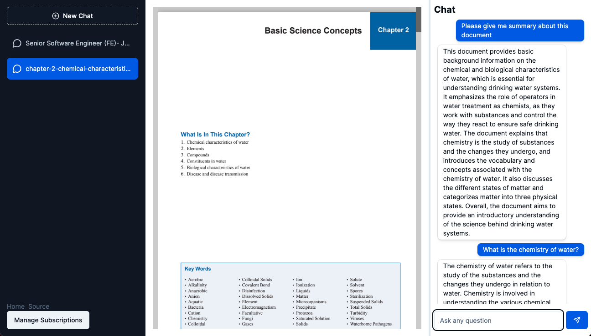

# Chat on PDF with AI

This app is designed for chatting with AI about the content in a PDF. When you ask a question, the AI will scan through the document to locate the relevant information and provide you with an answer.

## Technology used

1. React, TypeScript, NextJS, Tailwind CSS, React Query
2. Clerk Authentication, NeonDB(PostgresSQL), Drizzle ORM, AWS S3, OpenAI, Pinecone Vector DB, Stripe

## Demo View

1. Landing Page

2. After Login

3. In the chat window after a PDF has been uploaded, users can interact with the document and ask questions.

